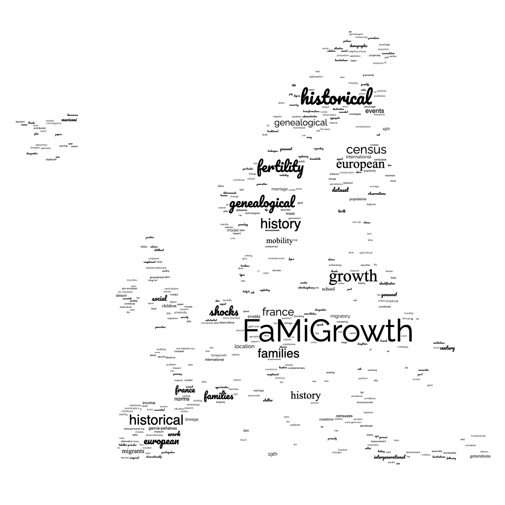

# Antony Gobriel

PhD Student in Economic History of Migration and Demography  
**IÉSEG School of Management** | **UMR 9221 – LEM, CNRS** | **University of Lille**

## Biography

I am a PhD Candidate in Economics at the University of Lille (LEM-CNRS 9221) and the IÉSEG School of Management. I am also a member of the IFLAME research center.

I hold a Master's degree in Public Policy from Université Paris 1 Panthéon-Sorbonne, as well as Bachelor's degrees in Economics from Paris 1 and Cairo University.

My research specializes in the economic history of migration and demography. I study how migration contributed to economic growth in the West since the Industrial Revolution.

## Research & Working Papers

* **The Rise of International Migration: Evidence from Genealogical Data** *(Work in Progress, 2026)*  
  *With* [Simone Moriconi](https://www.simone-moriconi.com/) *and* [Riccardo Turati](https://sites.google.com/view/riccardoturati)  
  

  
Abstract

  Little research has identified the determinants of historical migration flows in Europe, largely due to data scarcity. Using a new genealogical dataset, we study the transitions from regional migration to intra-European and transatlantic migration.
  

## Teaching

* **Microeconomics** – Lecturer, IÉSEG School of Management (Undergraduate), Fall 2025

## Curriculum Vitae

* [Download my CV (PDF)](cv.pdf)

## Affiliations

  
  
  
  
  
  

## Contact

* **Email:** [a.gobriel@ieseg.fr](mailto:a.gobriel@ieseg.fr)
* **BlueSky:** [@antonygobriel.bsky.social](https://bsky.app/profile/antonygobriel.bsky.social)
* **LinkedIn:** [antony-gobriel](https://www.linkedin.com/in/antony-gobriel)
